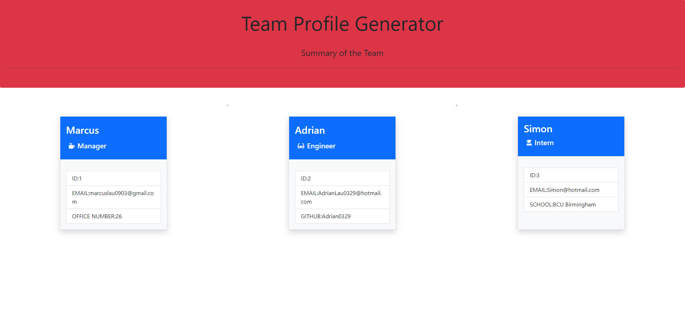
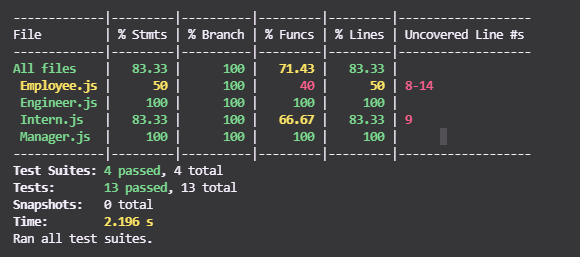

# 10 Object-Oriented Programming: Team Profile Generator

## Description

The application dynamically generates a HTML team profile webpage that contain summaries of employee information of a software engineering team. The app uses **Inquirer Node.JS** to prompt user questions such as job titles including Manager, Engineer and Intern - followed by specific questions regarding each role. Employee cards are generated based on input collected & displayed on the webpage (file accessible from the dist folder). In addition, the program uses **Jest** as the testing framework for all methods and constructor classes. 

## Installation

- Clone repository to your local machine.
- Input `npm i` on command-line terminal to install packages in the program.
- Input `npm start` in terminal to run the application.

## Tests

- Run unit test scripts by inputting `npm run test` on terminal.  

## Link to Video Demonstration 
[click here]()

## Link to Github repository
[click here](https://github.com/marcuslau0903/09-Node.js-Homework-Professional-README-Generator/blob/master/Develop/GeneratedREADME.md)

## Screenshot of Team Profile Generator

### Test Results
